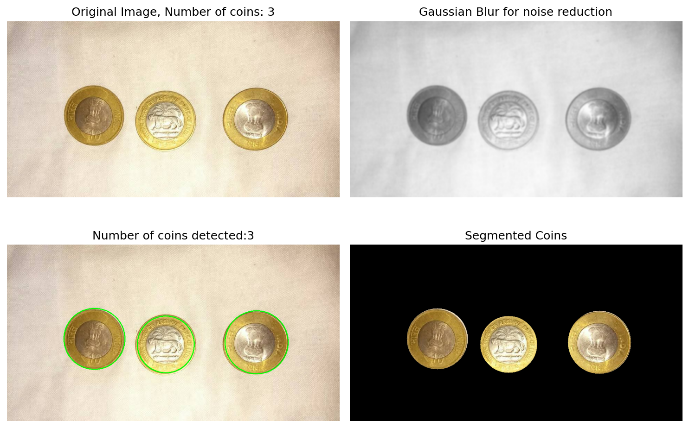
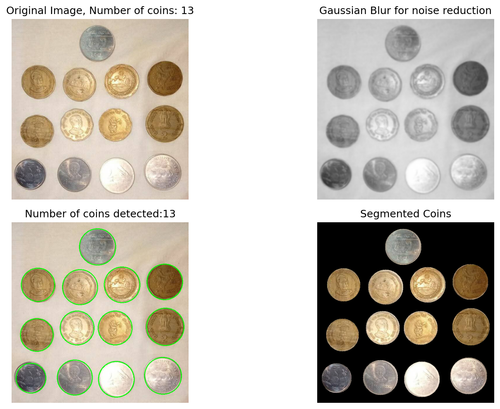
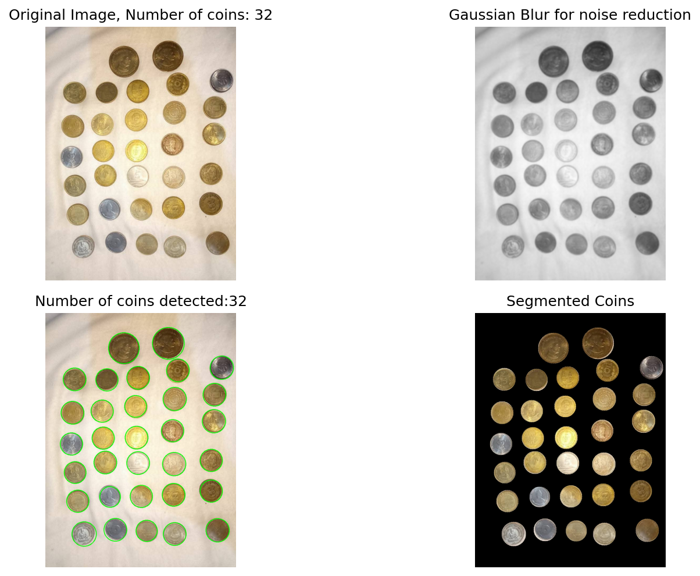
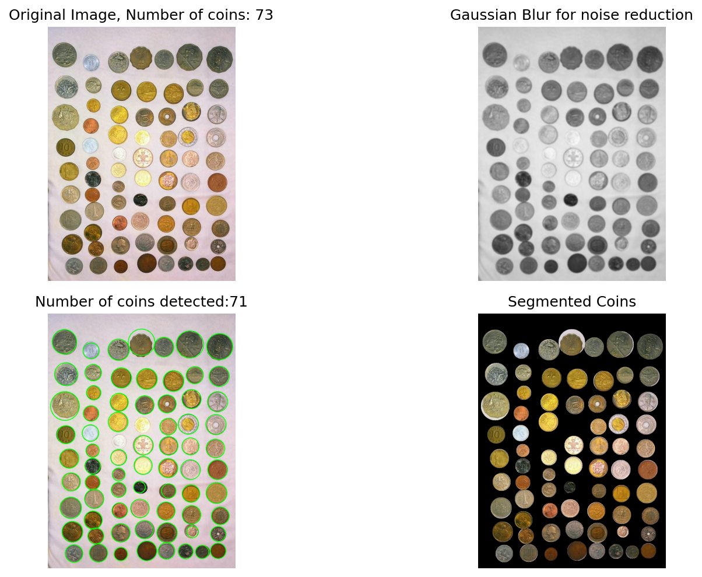
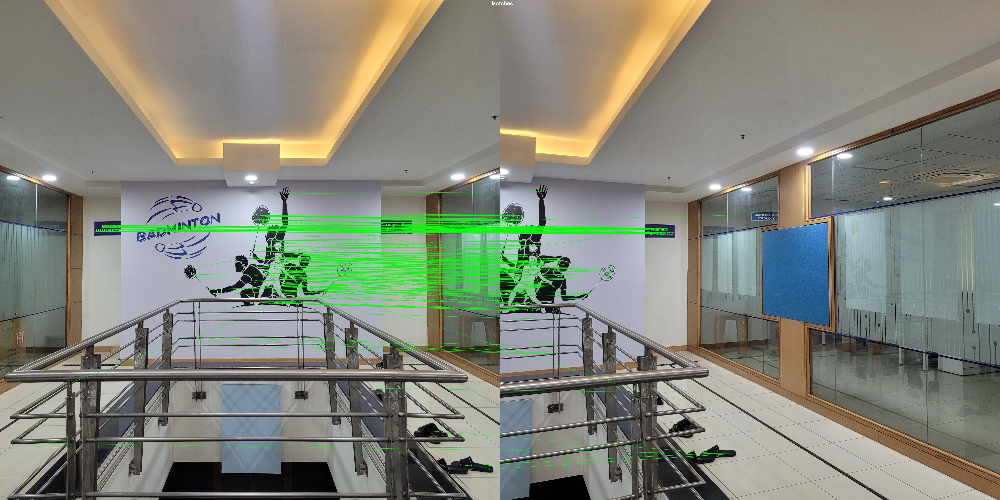
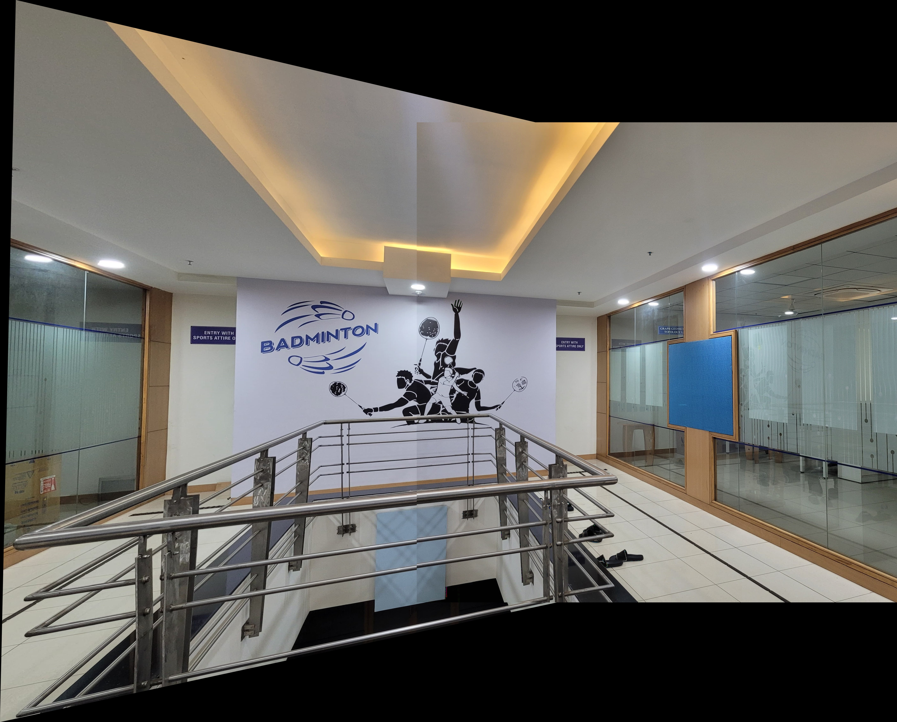

# Coin Detection and Panorama Stitching

This repository contains implementations for two computer vision tasks:
1. **Coin Detection and Segmentation** using the HoughCircles algorithm.
2. **Panorama Stitching** using SIFT keypoint detection and cosine distance for matching.

---

## 1. Coin Detection and Segmentation

### Method
The coin detection method leverages OpenCV's HoughCircles algorithm with parameters that vary based on the coin image:
- **Minimum Radius (`minR`) and Maximum Radius (`maxR`):** Set according to the coin size.
- **Minimum Distance (`minDist`):** The minimum distance between detected circles.
- **Preprocessing:** A Gaussian blur is applied to reduce noise before detection.

The algorithm detects circles, counts coins, and segments individual coins from the background.

### Accuracy
The detection accuracy for the test images is as follows:

| Test Image | Expected Coins | Detected Coins | minR | maxR | minDist |
|------------|----------------|----------------|------|------|---------|
| Test 1     | 3              | 3              | 25   | 95   | 60      |
| Test 2     | 13             | 13             | 25   | 95   | 60      |
| Test 3     | 32             | 32             | 25   | 95   | 60      |
| Test 4     | 73             | 71             | 15   | 60   | 30      |

### Output Images
The output images generated by the coin detection process are:

- **3 Coins:**  
  
- **13 Coins:**  
  
- **32 Coins:**  
  
- **73 Coins:**  
  

### Code Reference
The implementation is available in the file: `coin.py`  
Refer to the code for detailed parameter settings and visualization steps.

---

## 2. Panorama Stitching

### Method
The panorama stitching process involves:
- **Keypoint Detection:** Using the SIFT detector to extract keypoints from both images.
- **Keypoint Matching:** Matching keypoints between images using cosine distance, with Lowe's ratio test to filter good matches.
      *Note: Other distance metrics were attempted for keypoint matching, but the cosine distance approach yielded the best results.*
- **Homography and Stitching:** Computing a homography matrix based on matched keypoints and blending the images to create a panorama.

### Output Images
The panorama stitching results include:

- **Matches Visualization:**  
  
- **Stitched Panorama:**  
  

### Code Reference
The panorama stitching method is implemented in `panorama_viz.py`  
For detailed implementation, including the custom cosine similarity matcher, refer to the code.

---


## Directory Structure

Please follow a similar directory structure for the repository:
- **coin_input/**: Contains the coin input images.
- **coin_results/**: Will store the output images generated by coin detection.
- **panorama_input/**: Contains the images used for panorama stitching.
- **panorama_results/**: Will store the stitched panorama and match visualizations.

Ensure that your files are placed in the appropriate directories as specified in the code.

---

## Running the Code

## Dependencies

Before running the scripts, install the required Python packages by executing:

```bash
pip install -r requirements.txt
```

The coin detection script accepts a command-line argument `--num_coins` to specify the expected number of coins.
If no argument is provided, the script defaults to using 32 coins.

For example, to run the script for 13 coins, use:

```bash
python coin.py --num_coins 13
```

To run the panorama stitching script:

```bash
python panorama_viz.py
```
